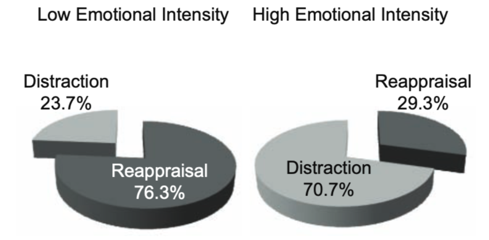

<!-- Reproducibility reports should all use this template to standardize reporting across projects. These reports will be public supplementary materials that accompany the summary report(s) of the aggregate results. -->

## Introduction

### Background

How do people decide which emotion regulation strategy to use in any
given situation? A series of experiments reported by Sheppes et al
(2011) provides evidence that individuals' choice of emotion regulation
strategy is driven by emotional intensity. Specifically, **Study 1 shows
that individuals prefer to use cognitive reappraisal when faced with
low-intensity negative stimuli and distraction when faced with
high-intensity negative stimuli.**

### Justification for choice of study

Past research on emotion-regulation choice has focused largely on
*intra*personal emotion regulation. However, in everyday life, people
often turn to others for help with their emotion regulation needs---a
phenomenon that has come to be known as *inter*personal emotion
regulation. As part of my work on interpersonal emotion regulation, I am
interested in examining the role of emotional intensity in driving
individuals' preference for intrapersonal vs. interpersonal strategies.
Replicating the finding from the original study (which was done in a
laboratory setting) is a critical first step in establishing the
robustness of the original finding as well as optimizing the
experimental paradigm for online contexts.

### Anticipated challenges

The absence of corrective feedback during the training and practice
phases presents a potential challenge for this replication attempt. Ways
of addressing this challenge in the present replication attempt are
described in detail in the Methods section of this report.

### Links

Project repository (on Github):
<https://github.com/psych251/sheppes2011>

Original paper (as hosted in your repo):
<https://github.com/psych251/sheppes2011/blob/main/original_paper/sheppes2011.pdf>

Preregistration: <https://osf.io/uzw4q/>

Experiment (same for pilot a, pilot b, and final replication):
[<https://web.stanford.edu/~kpetrova/cgi-bin/experiment.html>](https://web.stanford.edu/~kpetrova/cgi-bin/experiment.html){.uri}

## Methods

```{r setup, message=FALSE, warning=FALSE, include=FALSE}
library(tidyverse)
library(tidyr)
library(dplyr)
library(readxl)
library(lme4)
library(stats)
library(effectsize)
library(pwr)
```

### Power Analysis

Converting partial eta squared (reported in the original paper) to f\^2
(which is required by the 'pwr' package that will be used for power
analysis):

```{r power analysis 1, message=FALSE, warning=FALSE, include=TRUE, echo = TRUE}
effectsize::eta2_to_f2(.71)
```

Calculating denominator degrees of freedom (v) for estimation of target
effect size for a generalized linear model:

```{r power analysis 2, message=FALSE, warning=FALSE, include=TRUE, echo = TRUE}
# 80% power
pwr.f2.test(u = 1, f2 = 2.45, sig.level = .05, power = .80)

# 90% power
pwr.f2.test(u = 1, f2 = 2.45, sig.level = .05, power = .90)

# 95% power
pwr.f2.test(u = 1, f2 = 2.45, sig.level = .05, power = .95)
```

*Note*: </br> \* *v = N - 1* </br> \* *I will parameterize the repeated
measures ANOVA (that will be used to test the main hypothesis) as a
generalized linear mixed model, which is why I used the "f2" option for
power calculations.*

### Planned Sample

A priori power analysis revealed that a minimum sample size of N = 7 is
required to detect the main effect f\^2 = 2.45 at a significance level
of alpha (two-sided) = .05 with at least 95% power. Because the effect
size observed in the present replication attempt may be smaller than the
effect size reported in the original study (see section on the
differences from the original study below), and in order to ensure that
the sample is sufficiently large after low quality observations are
excluded, I will aim to recruit a sample of the same size as the one
used in the original study (N = 20).

### Materials

Images from the International Affective Picture System (Lang et al.,
2008; n = 8 in the training and practice phase; n = 30 in the
experimental phase) will be presented to participants using a standard
image presentation template in jsPsych. The same images that were used
in the original experiment will be used in this replication (a full list
of image IDs appears in the [Supplementary
Materials:](https://github.com/psych251/sheppes2011/blob/main/original_paper/sheppes2020_supplement.pdf))
of the original paper.

### Procedure

The procedures outlined in the Method section of the original study will
be followed with a few necessary deviations (see below). </br> </br>
**1. Training phase.** Participants will be instructed to look at 4
images while implementing one of two regulatory strategies: </br> </br>
Distraction: thinking about something that is emotionally neutral (2
trials; 1 low-intensity, 1 high-intensity). </br> Reappraisal: thinking
about an image in a way that reduces its negative meaning (2 trials; 1
low-intensity, 1 high-intensity). </br> </br> **2. Practice phase.**
Participants will complete 8 practice trials: 4 trials with have
pre-determined regulation strategy (one trial for each strategy at each
intensity level) and 4 trials with participants freely choosing which
strategy to use. </br> </br> **3. Experimental phase.** Participants
will view 30 images for 500ms and choose one of two regulation
strategies to implement for each image. They will then view each image
for 5,000ms while implementing the chosen strategy. The same 30 images
that were used in the original study by Sheppes et al (2011) will be
used

### Analysis Plan

The authors of the original study compare how often participants choose
reappraisal over distraction (DV: percentage of trials on which
reappraisal was chosen) on low-intensity and high-intensity trials (IV:
trial type). To characterize the magnitude of the effect of trial type
on emotion regulation choice, the authors report the F-value, partial
eta squared, and the 95% confidence interval. To facilitate direct
comparison of the results reported in the original study to the results
obtained as part of this replication attempt, I will fit a one-way
repeated-measures ANOVA.

```{r data prep, message=FALSE, warning=FALSE, include=FALSE}
setwd("~/OneDrive - Stanford/Classes/PSYC_251/sheppes2011")
fake_data = read_excel("simulated_data/fake_data.xlsx")
head(fake_data)

simulated_data <- fake_data |>
  mutate(reappraisal = grepl("1", strategy)) |>
  mutate(distraction = grepl("2", strategy)) |>
  group_by(id, trial_type) |>
  summarise(
            percent_reappraisal = ((sum(reappraisal)/(sum(distraction)+sum(reappraisal)))*100),
            percent_distraction = ((sum(distraction)/(sum(distraction)+sum(reappraisal)))*100)) |>
  mutate(trial_type = factor(trial_type, levels=c(1, 2), labels=c("Low", "High")))
```

Processed data will have the following format:

```{r show data, include=T, warning=FALSE, message=FALSE, echo = T}
head(simulated_data)
```

Key model parameters will be derived as follows:

```{r glm, include=T, warning=FALSE, message=FALSE, echo = T}
# The model is parameterized as a generalized linear mixed effects model for ease of implementation on tidy data. The solution is mathematically equivalent to a standard implementation of a repeated measures ANOVA. 
model1 <- lmer(percent_reappraisal ~ trial_type + (1|id), simulated_data)
anova(model1, test= "F")
confint(model1)
eta_squared(model1)
```

**Exclusion criteria.** Participants whose responses to open-ended
questions during the training phase of the study indicate failure to
follow the instructions will be excluded from analyses.

**Clarify key analysis of interest here** One-way repeated-measures
ANOVA.

**Reproducibility criteria.** Given the potential challenges associated
with implementing this experiment online, a large effect (partial eta
squared \> .14) of emotional intensity on emotion regulation choice in
the expected direction will be sufficient to consider this replication
attempt successful.

### Differences from Original Study

1.  Unlike in the original study that was performed in a sample of
    undergraduate students, the present replication will be performed on
    a sample of participants recruited online via Prolific. This
    difference in sample composition is not expected to affect the key
    outcome of the study.
2.  In addition, unlike the original experiment that took place in a
    laboratory setting, this replication will be conducted online. This
    difference in the experimental setting is not expected to affect the
    key outcome in and of itself. However, because participants will not
    be asked to talk through their emotion regulation out loud during
    the training and practice phases, and because there will be no
    experimenter to provide corrective feedback, it is possible that
    some participants may fail to apply distraction and reappraisal
    correctly, which could lead to a smaller effect size in this
    replication compared to the original study. To ensure compliance,
    participants will be asked to *write down* their approach to
    implementing the two strategies during two of the training trials.
    Participants whose responses indicate failure to follow the
    instructions will be excluded from analyses.
3.  Finally, unlike in the original experiment, participants in the
    present study will not be videotaped to ensure that they are viewing
    the stimuli without diverting their gaze for the entire duration of
    stimulus presentation (500 ms during strategy selection and 5,000 ms
    during strategy implementation). No participants were excluded from
    the original study because they failed to attend to the stimuli,
    which is why the lack of videotaping is not expected to affect
    participant engagement in the present replication attempt.

### Methods Addendum (Post Data Collection)

#### Actual Sample

Twenty participants were recruited online via Prolific and compensated
at the rate of \$12/hour for their participation. Participants age
ranged from 20 on the low end to 58 on the high end (*M* = 30.83, *SD* =
12.29). A total of 17 participants (85%) identified as female, 2 (10%)
as male, as 1 (5%) as non-binary. In accordance with the *a priori*
defined exclusion criteria, 3 participants were excluded because their
responses to at least one of the two open-ended questions (asking them
to describe how exactly they implemented reappraisal and distraction)
indicated a clear failure to follow the emotion regulation instructions.
Specifically, one of the excluded sparticipant simply described the
image stimuli instead of regulating their emotions, and two additional
participants described using distraction after being instructed to use
reappraisal. These exclusions brought the final sample size down to 17
participants, which exceeds the minimum number of participants (7)
needed to detect a large effect size with 95% power.

#### Differences from pre-data collection methods plan

None.

## Results 

### Pilot A

#### Participants.

Two non-naive participants.

#### Data preparation

Data preparation following the analysis plan.

```{r data prep pilot a, message=FALSE, warning=FALSE, include=TRUE}
# Concatenated participant data as input
pilot_a = read_csv("pilot_a_rawdata/pilot_a.csv")
head(pilot_a)
# Tidying + calculating % reappraisal in two types of trials
pilot_a_tidy <- pilot_a |>
  filter(grepl("l.jpg|l.JPG|h.jpg|h.JPG", stimulus)) |>
  filter(grepl("image-button-response", trial_type)) |>
  mutate(intensity = ifelse(grepl('l.jpg|l.JPG', stimulus), 'low', 'high')) |>
  select(!(c(stimulus, key_press, time_elapsed, internal_node_id))) |>
  mutate(reappraisal = grepl("0", button_pressed)) |>
  mutate(distraction = grepl("1", button_pressed)) |>
  group_by(subject, intensity) |>
  summarise(
            percent_reappraisal = ((sum(reappraisal)/(sum(distraction)+sum(reappraisal)))*100),
            percent_distraction = ((sum(distraction)/(sum(distraction)+sum(reappraisal)))*100))
# Tidy data ready for glm
head(pilot_a_tidy)
```

#### Confirmatory analysis

```{r glm pilot a, include=T, warning=FALSE, message=FALSE, echo = T}
model_pilot_a <- lmer(percent_reappraisal ~ intensity + (1|subject), pilot_a_tidy)
anova(model_pilot_a, test= "F")
#confint(model_pilot_a)
#eta_squared(model_pilot_a)
```

### Pilot B

#### Participants.

Three participants recruited via Prolific.

#### Data preparation

Data preparation following the analysis plan.

```{r data prep pilot b, message=FALSE, warning=FALSE, include=TRUE}
# Concatenated participant data as input
pilot_b = read_csv("pilot_b_rawdata/pilot_b.csv")
head(pilot_b)
# Tidying + calculating % reappraisal in two types of trials
pilot_b_tidy <- pilot_b |>
  filter(grepl("l.jpg|l.JPG|h.jpg|h.JPG", stimulus)) |>
  filter(grepl("image-button-response", trial_type)) |>
  mutate(intensity = ifelse(grepl('l.jpg|l.JPG', stimulus), 'low', 'high')) |>
  select(!(c(stimulus, key_press, time_elapsed, internal_node_id))) |>
  mutate(reappraisal = grepl("0", button_pressed)) |>
  mutate(distraction = grepl("1", button_pressed)) |>
  group_by(subject, intensity) |>
  summarise(
            percent_reappraisal = ((sum(reappraisal)/(sum(distraction)+sum(reappraisal)))*100),
            percent_distraction = ((sum(distraction)/(sum(distraction)+sum(reappraisal)))*100))
# Tidy data ready for glm
head(pilot_b_tidy)
```

#### Confirmatory analysis

```{r glm pilot b, include=T, warning=FALSE, message=FALSE, echo = T}
model_pilot_b <- lmer(percent_reappraisal ~ intensity + (1|subject), pilot_b_tidy)
anova(model_pilot_b, test= "F")
confint(model_pilot_b)
eta_squared(model_pilot_b)
```

### Final replication results

#### Data preparation following the analysis plan.

```{r data prep final, message=FALSE, warning=FALSE, include=TRUE}
# Concatenated participant data as input
rep_data = read_csv("replication_rawdata/replication_data.csv")
head(rep_data)
# Tidying + calculating % reappraisal in two types of trials
rep_data_tidy <- rep_data |>
  filter(grepl("l.jpg|l.JPG|h.jpg|h.JPG", stimulus)) |>
  filter(grepl("image-button-response", trial_type)) |>
  mutate(intensity = ifelse(grepl('l.jpg|l.JPG', stimulus), 'low', 'high')) |>
  select(!(c(stimulus, key_press, time_elapsed, internal_node_id))) |>
  mutate(reappraisal = grepl("0", button_pressed)) |>
  mutate(distraction = grepl("1", button_pressed)) |>
  group_by(subject, intensity) |>
  summarise(
            percent_reappraisal = ((sum(reappraisal)/(sum(distraction)+sum(reappraisal)))*100),
            percent_distraction = ((sum(distraction)/(sum(distraction)+sum(reappraisal)))*100))
# Tidy data ready for glm
head(rep_data_tidy)

# Excluding participants who did not follow instructions for at least one of the two emotion regulation strategies (N = 3)
rep_data_tidy_N17 <- rep_data_tidy |>
  filter(subject != "gy0bq" & subject != "m821x" & subject != "qz80b")
```

#### Confirmatory analysis

```{r glm final replication, include=T, warning=FALSE, message=FALSE, echo = T}
model_replication <- lmer(percent_reappraisal ~ intensity + (1|subject),  rep_data_tidy_N17)
anova(model_replication, test = "F")
summary(model_replication)
confint(model_replication)
eta_squared(model_replication)
```

```{r plot pilot b, include=T, warning=FALSE, message=FALSE, echo = T}
library(patchwork)
# Re-arranging data for plot
rep_data_for_plot <- rep_data |>
  filter(subject != "gy0bq" & subject != "m821x" & subject != "qz80b") |>
  filter(grepl("l.jpg|l.JPG|h.jpg|h.JPG", stimulus)) |>
  filter(grepl("image-button-response", trial_type)) |>
  mutate(low_intensity = grepl('l.jpg|l.JPG', stimulus)) |>
  mutate(high_intensity = grepl('h.jpg|h.JPG', stimulus)) |>
  select(!(c(stimulus, key_press, time_elapsed, internal_node_id))) |>
  mutate(Strategy = ifelse(grepl("0", button_pressed), "reappraisal", "distraction")) |>
  group_by(subject, Strategy) |>
  summarise(
            percent_low = ((sum(low_intensity)/(sum(high_intensity)+sum(low_intensity)))*100),
            percent_high = ((sum(high_intensity)/(sum(high_intensity)+sum(low_intensity)))*100))

# Low intensiy pie chart
low_plot <- ggplot(rep_data_for_plot, 
       aes(x="", 
           y=percent_low, 
           fill=Strategy)) +
  geom_bar(stat="identity", width=1) +
  coord_polar("y", start=0) +
  labs(title = "Low Emotional Intensity") +
  scale_color_manual(values = c("#408F8A", "#F4B43C")) +
  scale_fill_manual(values = c("#408F8A", "#F4B43C")) +
  theme_void()
  
# High intensity pie chart
high_plot <- ggplot(rep_data_for_plot, 
       aes(x="", 
           y=percent_high, 
           fill=Strategy)) +
  geom_bar(stat="identity", width=1) +
  coord_polar("y", start=0) +
  labs(title = "High Emotional Intensity")  +
  scale_color_manual(values = c("#408F8A", "#F4B43C")) +
  scale_fill_manual(values = c("#408F8A", "#F4B43C")) +
  theme_void()
```

##### Original findings:

{width="600"}

##### Replication:

```{r pie chart, echo=FALSE, message=FALSE, warning=FALSE}
library(patchwork)
low_plot + high_plot + plot_layout(ncol=2)
```

## Discussion

### Summary of Replication Attempt

The present replication study examined the effects of emotional
intensity on emotion regulation choice. The results clearly indicate
that individuals prefer to use reappraisal as a strategy for regulating
negative emotions when emotional intensity is low and distraction when
emotional intensity is high (ηp2 = .91). This is consistent with the
findings by Sheppes et al (2011) who first reported this effect (ηp2 =
.71).

### Commentary

Overall, the success of this replication attempt and the fact that the
large effect of emotional intensity on emotion regulation choice can be
detected even when participants receive no corrective feedback or
supervision goes a long way in showing the robustness of the effect and
further strengthening our collective confidence in what has become one
of the seminal findings in contemporary affective science.

It is my hope that the fully online implementation of the emotion
regulation choice paradigm that I developed for this project (and that
is now publicly available in the "experiment" folder of the repository)
will be a useful resource for researchers who wish to use this paradigm
in future studies of emotion regulation.
